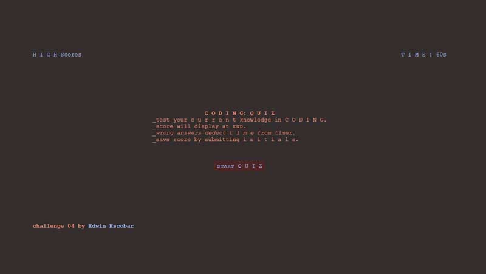

# challenge-04
Web APIs Challenge: Code Quiz

Quiz is composed of four in d e p t h questions. User has 60 seconds to answer all four questions (wrong answers will  penalize the user by sever time deductions). Initials & score may be saved at the end of the quiz.

HTML: minimalist approach.

CSS: dark-mode aesthetic.

JS: the heavy lifting code. tapping into the DOM, local storage, and dynamically generating html elements for the index.

Live URL
https://escowin.github.io/challenge-04/

GitHub Repository
https://github.com/escowin/challenge-04
