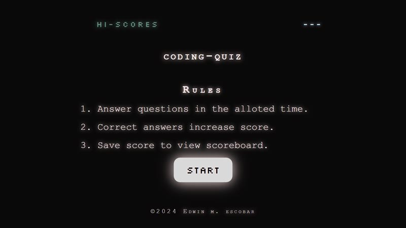

# coding-quiz
Live URL https://escowin.github.io/coding-quiz/

Repo https://github.com/escowin/coding-quiz

## Description
Quiz is composed of the most in-depth questions known to web development.

* HTML: minimalist approach.

* CSS: dark-mode aesthetic.

* JS: the heavy lifting code. tapping into the DOM,  dynamically generating html elements for the index.

## Screenshot

## Author
<a href="https://github.com/escowin" target="_blank">Edwin Escobar</a>